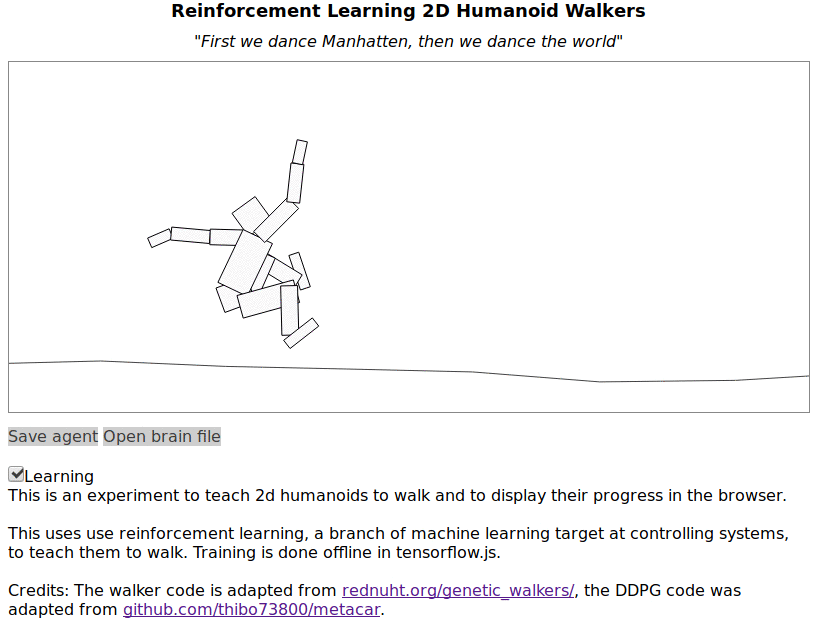

# 2D Humanoid Walker js

This project is a reinforcement learning environment for node. You can train a model offline using tensorflow.js then deploy the result to the browser. And example is http://thinkcds.com/2d_walker/.

## Installation & Usage

- `git clone https://github.com/wassname/rl_2d_walker.js.git`
- `npm install`
- `npm i -g webpack-dev-server webpack`
- `npm train`: this will train in node
  - you ideally need a CUDA capable GPU with 8GB+ of memory.
  - will take 8 hours to see results, 44 hours for good results
- `npm start` (in another terminal): this will start a server to view the results. Result will refresh every few hours when a model checkpoint in saved.

## Modifying

- The walker: see walker.js
- The agent: see game.js, and ddpg_agent.js

## Contributing

1. Fork it!
2. Create your feature branch: `git checkout -b my-new-feature`
3. Commit your changes: `git commit -am 'Add some feature'`
4. Push to the branch: `git push origin my-new-feature`
5. Submit a pull request :D

# Credits

- Made by wassname for thinkcds.com
- The walker code is adapted from <a href="http://rednuht.org/genetic_walkers/">http://rednuht.org/genetic_walkers/</a>
- DDPG code from metacar

# Future work

- [ ] I would like to tweak the strength, stiffness (in box2d this seems to be max torque), friction, etc to allow a more elegant walking behaviour
- [ ] Clean up the html UI
